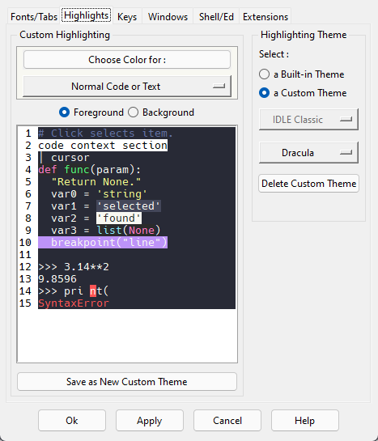

# Dracula for [IDLE](https://docs.python.org/3/library/idle.html)

> A dark theme for [IDLE](https://docs.python.org/3/library/idle.html).

## Install

All instructions can be found at [draculatheme.com/idle](https://draculatheme.com/idle).

## Team

This theme is maintained by the following person(s) and a bunch of [awesome contributors](https://github.com/dracula/idle/graphs/contributors).

|  |
| ----------------------------------------------------------------------------------------------------------------------------------------------- |
| [Rex Ng](https://github.com/timescam)                                                                                                           |

## License

[MIT License](./LICENSE)
